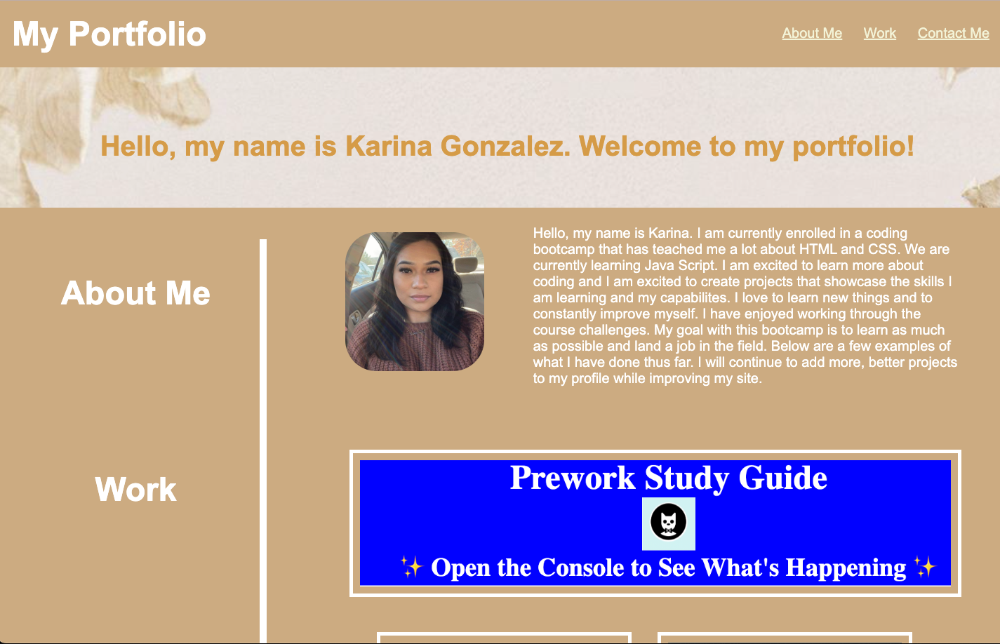

# My Portfolio

## Description
This webpage was created with the intentions of using as my portfolio to showcase my current and future work. I will continue to add and improve this page. I learned a lot about creating a portfolio and have much more to learn. 

## About Me
Hello, my name is Karina. I am currently enrolled in a coding bootcamp that has teached me a lot about HTML and CSS. We are currently learning Java Script. I am excited to learn more about coding and I am excited to create projects that showcase the skills I am learning and my capabilites. I love to learn new things and to constantly improve myself. I have enjoyed working through the course challenges. My goal with this bootcamp is to learn as much as possible and land a job in the field. Below are a few examples of what I have done thus far. I will continue to add more, better projects to my profile while improving my site.

https://github.com/2023kgl/my-portfolio

https://2023kgl.github.io/my-portfolio/

!
